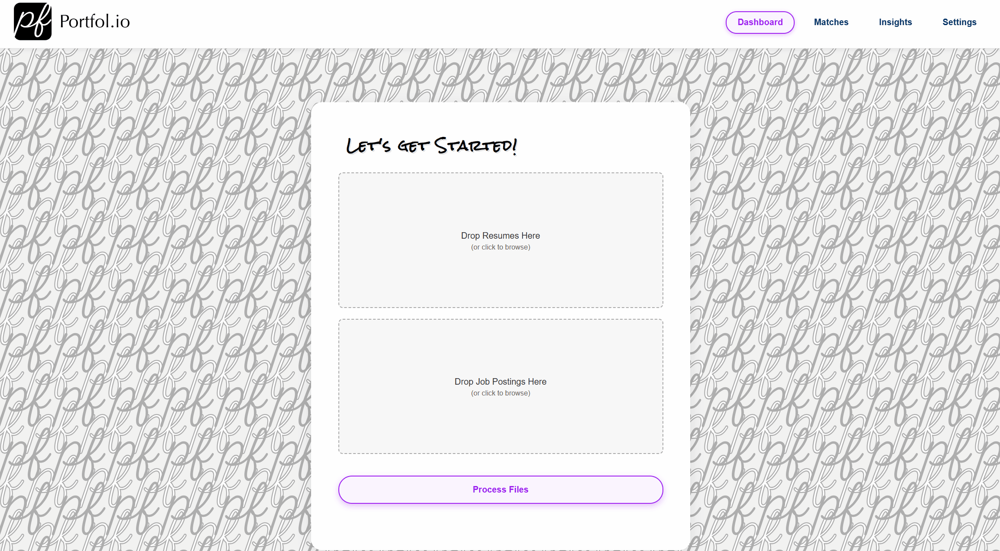

Portfol.io: LLM-enhanced Developer Portfolio Evaluation using MAS
===================================================================

**Version:** 1.0 

**Author:** Luis Manuel Postigo

Introduction
-------------

Portfol.io is a Multi-Agent System (MAS) designed to enhance the evaluation of developer portfolios by leveraging Large Language Models (LLMs) for resume parsing, portfolio validation, and decision-making.  
The goal is to automate the hiring process by evaluating real-world coding contributions rather than relying solely on self-reported resume claims.

Problem Statement
------------------

Traditional hiring practices are prone to inefficiencies, inconsistencies, and subjective judgments.  
Manual evaluation of candidate portfolios is time-consuming and technically demanding.

Portfol.io addresses these challenges by:

- Parsing resumes to extract key skills, experiences, and projects.
- Analyzing actual coding portfolios (e.g., GitHub).
- Matching claimed skills with real-world evidence.
- Providing recruiters with an informed, scalable, and automated decision process.

System Overview
----------------

The MAS is composed of six primary agents, each with a specialized role:

- **Recruiter Agent:** Parses resumes and extracts key information using NLP.
- **Hiring Manager Agent:** Validates career progression, job fit, and salary expectations.
- **Technical Lead Agent:** Conducts deep code analysis for structure, maintainability, and coding standards.
- **Portfolio Analyzer Agent:** Compares real project contributions against resume claims.
- **HR Compliance Agent:** Ensures compliance with employment policies and salary expectations.
- **Decision Maker Agent:** Aggregates agent evaluations using multi-criteria decision-making.

Each agent acts autonomously and interacts using a shared communication protocol and ontology, following best practices for agent-to-agent collaboration.
The current models being used have a limited context window of 4096 tokens, which is a constraint for the system. This, can be mitigated by using a memory agent, which can store the information of the previous interactions and provide it to the agents when needed, which is a pending work.
You can also change the models to use the ones that you prefer, but the system is designed to work with the ones mentioned in the architecture section, so some refinements to the prompts may be needed. For such I recommend either using the following documentation:

- https://services.google.com/fh/files/misc/gemini-for-google-workspace-prompting-guide-101.pdf
- Or directly from the documentation of the models you are using. Most of them can be found on Hugging Face.

Architecture
-------------

**Directory Structure:**

::

    /Portfol.io
    ├── /agents
    │   ├── recruiter_agent.py        # Resume Parsing (NLP + GPT-4)
    │   ├── hiring_manager_agent.py   # Job Fit Analysis (Embeddings)
    │   ├── portfolio_agent.py         # GitHub Analysis (Qwen)
    │   ├── technical_lead_agent.py    # Deep Code Evaluation (Qwen)
    │   ├── hr_compliance_agent.py     # Experience Validation
    │   ├── decision_agent.py          # Multi-Criteria Ranking (GPT-4)
    ├── /services
    │   ├── llm_utils.py               # LLM API Calls (OpenAI, Meta, Qwen)
    │   ├── db_manager.py              # Database Operations (PostgreSQL/MongoDB)
    │   ├── message_queue.py           # Messaging (RabbitMQ/Kafka)
    ├── /datasets
    │   ├── portfolios.json
    │   ├── resumes.json
    ├── /tests
    │   ├── test_recruiter.py
    │   ├── test_portfolio.py
    ├── config.yaml
    ├── main.py                        # Entry point for launching the system

Key Technologies
-----------------

.. image:: docs/img/Animation2.gif
   :alt: Key Technologies Demo
   :align: center

- **Large Language Models:** phi-2.Q4_K_M & DeepSeek Coder
- **Messaging Framework:** RabbitMQ
- **Database:** MongoDB
- **Web Scraping (Future Work):** GitHub project scraping for real-world project validation
- **NLP Techniques:** Skill extraction, resume parsing, job-posting alignment

Implementation Plan
--------------------

- Development starts with the Recruiter Agent for resume parsing.
- Followed by Hiring Manager Agent for job-fit validation.
- Portfolio Analyzer and Technical Lead Agent for code and portfolio verification.
- HR Compliance Agent to ensure hiring policy adherence.
- Decision Agent to compile, weigh, and recommend the final hiring decision.

Testing Strategy
----------------

The system will be tested using a dataset of resumes and portfolios with varied quality levels.  
Evaluation focuses on individual agent accuracy and false positive/negative rates rather than aggregate match scores.

Pending Work
------------

- Implementing advanced portfolio scraping and evaluation.
- GUI visualization for agent interactions.
- Integration of a final Decision Agent capable of nuanced negotiation and decision-making.
- Bias mitigation techniques and explainability mechanisms.

Challenges
----------

- Lack of publicly available datasets combining resumes and portfolios.
- Ambiguity in defining skill proficiency and job requirements.
- Balancing LLM computational cost with system performance.
- Ensuring scalability when multiple agents query shared LLM models.

References
----------

1. Bubeck, Sébastien, et al. "Sparks of artificial general intelligence: Early experiments with GPT-4." (2023).
2. Touvron, Hugo, et al. "Llama 2: Open foundation and fine-tuned chat models." (2023).
3. Bagga, Pallavi, et al. "Deep learnable strategy templates for multi-issue bilateral negotiation." (2022).
4. Zhang, Yusen, et al. "Chain of Agents: Large Language Models Collaborating on Long-Context Tasks." (2024).
5. Knight, Will. "The Most Capable Open Source AI Model yet Could Supercharge AI Agents." Wired, (2024).

License
-------

For academic purposes only. All rights reserved by the authors.

Getting Started
------------------

In order to access applicants portfolios, you need to have a GitHub token. You can create one by following the instructions in the GitHub documentation.
https://docs.github.com/en/authentication/keeping-your-account-and-data-secure/managing-your-personal-access-tokens#creating-a-personal-access-token-classic

Downloading the models:

deepseek-coder-1.3b-instruct.Q4_K_M: https://huggingface.co/TheBloke/deepseek-coder-1.3b-instruct-GGUF/blob/main/deepseek-coder-1.3b-instruct.Q4_K_M.gguf
